```mermaid
flowchart TB
    subgraph upstream["Dependants (2)"]
        P2["<b>📦&nbsp;Demo.csproj</b><br/><small>net8.0-windows;net6.0-windows;net48</small>"]
        P3["<b>📦&nbsp;UnitTests.csproj</b><br/><small>net8.0-windows;net48</small>"]
        click P2 "#demodemocsproj"
        click P3 "#unittestsunittestscsproj"
    end
    subgraph current["CDS.Markdown.csproj"]
        MAIN["<b>📦&nbsp;CDS.Markdown.csproj</b><br/><small>net8.0-windows;net6.0-windows;net48</small>"]
        click MAIN "#cdsmarkdowncdsmarkdowncsproj"
    end
    P2 --> MAIN
    P3 --> MAIN

```

```mermaid
flowchart TB
    subgraph current["Demo.csproj"]
        MAIN["<b>📦&nbsp;Demo.csproj</b><br/><small>net8.0-windows;net6.0-windows;net48</small>"]
        click MAIN "#demodemocsproj"
    end
    subgraph downstream["Dependencies (1"]
        P1["<b>📦&nbsp;CDS.Markdown.csproj</b><br/><small>net8.0-windows;net6.0-windows;net48</small>"]
        click P1 "#cdsmarkdowncdsmarkdowncsproj"
    end
    MAIN --> P1

```

```mermaid
flowchart TB
    subgraph current["UnitTests.csproj"]
        MAIN["<b>📦&nbsp;UnitTests.csproj</b><br/><small>net8.0-windows;net48</small>"]
        click MAIN "#unittestsunittestscsproj"
    end
    subgraph downstream["Dependencies (1"]
        P1["<b>📦&nbsp;CDS.Markdown.csproj</b><br/><small>net8.0-windows;net6.0-windows;net48</small>"]
        click P1 "#cdsmarkdowncdsmarkdowncsproj"
    end
    MAIN --> P1

```

# Projects and dependencies analysis

This document provides a comprehensive overview of the projects and their dependencies in the context of upgrading to .NETCoreApp,Version=v10.0.

## Table of Contents

- [Executive Summary](#executive-Summary)
  - [Highlevel Metrics](#highlevel-metrics)
  - [Projects Compatibility](#projects-compatibility)
  - [Package Compatibility](#package-compatibility)
  - [API Compatibility](#api-compatibility)
- [Aggregate NuGet packages details](#aggregate-nuget-packages-details)
- [Top API Migration Challenges](#top-api-migration-challenges)
  - [Technologies and Features](#technologies-and-features)
  - [Most Frequent API Issues](#most-frequent-api-issues)
- [Projects Relationship Graph](#projects-relationship-graph)
- [Project Details](#project-details)

  - [CDS.Markdown\CDS.Markdown.csproj](#cdsmarkdowncdsmarkdowncsproj)
  - [Demo\Demo.csproj](#demodemocsproj)
  - [UnitTests\UnitTests.csproj](#unittestsunittestscsproj)

## Executive Summary

### Highlevel Metrics

| Metric | Count | Status |
| :--- | :---: | :--- |
| Total Projects | 3 | All require upgrade |
| Total NuGet Packages | 6 | All compatible |
| Total Code Files | 21 |  |
| Total Code Files with Incidents | 13 |  |
| Total Lines of Code | 1343 |  |
| Total Number of Issues | 348 |  |
| Estimated LOC to modify | 345+ | at least 25.7% of codebase |

### Projects Compatibility

| Project | Target Framework | Difficulty | Package Issues | API Issues | Est. LOC Impact | Description |
| :--- | :---: | :---: | :---: | :---: | :---: | :--- |
| [CDS.Markdown\CDS.Markdown.csproj](#cdsmarkdowncdsmarkdowncsproj) | net8.0-windows;net6.0-windows;net48 | 🟡 Medium | 0 | 188 | 188+ | ClassLibrary, Sdk Style = True |
| [Demo\Demo.csproj](#demodemocsproj) | net8.0-windows;net6.0-windows;net48 | 🟡 Medium | 0 | 154 | 154+ | WinForms, Sdk Style = True |
| [UnitTests\UnitTests.csproj](#unittestsunittestscsproj) | net8.0-windows;net48 | 🟢 Low | 0 | 3 | 3+ | DotNetCoreApp, Sdk Style = True |

### Package Compatibility

| Status | Count | Percentage |
| :--- | :---: | :---: |
| ✅ Compatible | 6 | 100.0% |
| ⚠️ Incompatible | 0 | 0.0% |
| 🔄 Upgrade Recommended | 0 | 0.0% |
| ***Total NuGet Packages*** | ***6*** | ***100%*** |

### API Compatibility

| Category | Count | Impact |
| :--- | :---: | :--- |
| 🔴 Binary Incompatible | 306 | High - Require code changes |
| 🟡 Source Incompatible | 29 | Medium - Needs re-compilation and potential conflicting API error fixing |
| 🔵 Behavioral change | 10 | Low - Behavioral changes that may require testing at runtime |
| ✅ Compatible | 1034 |  |
| ***Total APIs Analyzed*** | ***1379*** |  |

## Aggregate NuGet packages details

| Package | Current Version | Suggested Version | Projects | Description |
| :--- | :---: | :---: | :--- | :--- |
| FluentAssertions | 8.5.0 |  | [UnitTests.csproj](#unittestsunittestscsproj) | ✅Compatible |
| Markdig | 0.41.3 |  | [CDS.Markdown.csproj](#cdsmarkdowncdsmarkdowncsproj) | ✅Compatible |
| Microsoft.NET.Test.Sdk | 17.14.1 |  | [UnitTests.csproj](#unittestsunittestscsproj) | ✅Compatible |
| Microsoft.Web.WebView2 | 1.0.3351.48 |  | [CDS.Markdown.csproj](#cdsmarkdowncdsmarkdowncsproj) | ✅Compatible |
| MSTest | 3.10.1 |  | [UnitTests.csproj](#unittestsunittestscsproj) | ✅Compatible |
| Nerdbank.GitVersioning | 3.7.115 |  | [CDS.Markdown.csproj](#cdsmarkdowncdsmarkdowncsproj) [Demo.csproj](#demodemocsproj) [UnitTests.csproj](#unittestsunittestscsproj) | ✅Compatible |

## Top API Migration Challenges

### Technologies and Features

| Technology | Issues | Percentage | Migration Path |
| :--- | :---: | :---: | :--- |
| Windows Forms | 306 | 88.7% | Windows Forms APIs for building Windows desktop applications with traditional Forms-based UI that are available in .NET on Windows. Enable Windows Desktop support: Option 1 (Recommended): Target net9.0-windows; Option 2: Add <UseWindowsDesktop>true</UseWindowsDesktop>; Option 3 (Legacy): Use Microsoft.NET.Sdk.WindowsDesktop SDK. |
| GDI+ / System.Drawing | 29 | 8.4% | System.Drawing APIs for 2D graphics, imaging, and printing that are available via NuGet package System.Drawing.Common. Note: Not recommended for server scenarios due to Windows dependencies; consider cross-platform alternatives like SkiaSharp or ImageSharp for new code. |

### Most Frequent API Issues

| API | Count | Percentage | Category |
| :--- | :---: | :---: | :--- |
| T:System.Windows.Forms.Button | 42 | 12.2% | Binary Incompatible |
| T:System.Windows.Forms.TableLayoutPanel | 18 | 5.2% | Binary Incompatible |
| T:System.Windows.Forms.Panel | 15 | 4.3% | Binary Incompatible |
| T:System.Windows.Forms.DockStyle | 15 | 4.3% | Binary Incompatible |
| T:System.Drawing.Bitmap | 13 | 3.8% | Source Incompatible |
| T:System.Windows.Forms.Label | 12 | 3.5% | Binary Incompatible |
| P:System.Windows.Forms.Control.Name | 10 | 2.9% | Binary Incompatible |
| P:System.Windows.Forms.Control.Size | 9 | 2.6% | Binary Incompatible |
| T:System.Windows.Forms.FlatStyle | 9 | 2.6% | Binary Incompatible |
| P:System.Windows.Forms.Control.TabIndex | 8 | 2.3% | Binary Incompatible |
| P:System.Windows.Forms.Control.Location | 8 | 2.3% | Binary Incompatible |
| T:System.Windows.Forms.Control.ControlCollection | 6 | 1.7% | Binary Incompatible |
| P:System.Windows.Forms.Control.Controls | 6 | 1.7% | Binary Incompatible |
| M:System.Windows.Forms.Control.ControlCollection.Add(System.Windows.Forms.Control) | 6 | 1.7% | Binary Incompatible |
| T:System.Drawing.Font | 6 | 1.7% | Source Incompatible |
| T:System.Windows.Forms.Application | 6 | 1.7% | Binary Incompatible |
| T:System.Windows.Forms.SizeType | 6 | 1.7% | Binary Incompatible |
| T:System.Uri | 5 | 1.4% | Behavioral Change |
| P:System.Windows.Forms.Control.Dock | 5 | 1.4% | Binary Incompatible |
| M:System.Windows.Forms.Control.ResumeLayout(System.Boolean) | 4 | 1.2% | Binary Incompatible |
| T:System.Windows.Forms.Padding | 4 | 1.2% | Binary Incompatible |
| F:System.Windows.Forms.DockStyle.Fill | 4 | 1.2% | Binary Incompatible |
| M:System.Windows.Forms.Control.SuspendLayout | 4 | 1.2% | Binary Incompatible |
| M:System.Uri.#ctor(System.String) | 3 | 0.9% | Behavioral Change |
| E:System.Windows.Forms.Control.Click | 3 | 0.9% | Binary Incompatible |
| P:System.Windows.Forms.ButtonBase.UseVisualStyleBackColor | 3 | 0.9% | Binary Incompatible |
| T:System.Drawing.Image | 3 | 0.9% | Source Incompatible |
| P:System.Windows.Forms.ButtonBase.Image | 3 | 0.9% | Binary Incompatible |
| M:System.Drawing.Font.#ctor(System.String,System.Single) | 3 | 0.9% | Source Incompatible |
| P:System.Windows.Forms.Control.Font | 3 | 0.9% | Binary Incompatible |
| F:System.Windows.Forms.FlatStyle.Flat | 3 | 0.9% | Binary Incompatible |
| P:System.Windows.Forms.ButtonBase.FlatStyle | 3 | 0.9% | Binary Incompatible |
| T:System.Windows.Forms.FlatButtonAppearance | 3 | 0.9% | Binary Incompatible |
| P:System.Windows.Forms.ButtonBase.FlatAppearance | 3 | 0.9% | Binary Incompatible |
| P:System.Windows.Forms.FlatButtonAppearance.BorderSize | 3 | 0.9% | Binary Incompatible |
| M:System.Windows.Forms.Button.#ctor | 3 | 0.9% | Binary Incompatible |
| T:System.Windows.Forms.AutoScaleMode | 3 | 0.9% | Binary Incompatible |
| T:System.Drawing.ContentAlignment | 3 | 0.9% | Source Incompatible |
| T:System.Windows.Forms.BorderStyle | 3 | 0.9% | Binary Incompatible |
| M:System.Windows.Forms.UserControl.#ctor | 2 | 0.6% | Binary Incompatible |
| M:System.Windows.Forms.Padding.#ctor(System.Int32) | 2 | 0.6% | Binary Incompatible |
| P:System.Windows.Forms.Control.Padding | 2 | 0.6% | Binary Incompatible |
| T:System.Windows.Forms.HighDpiMode | 2 | 0.6% | Binary Incompatible |
| F:System.Windows.Forms.SizeType.Percent | 2 | 0.6% | Binary Incompatible |
| T:System.Windows.Forms.RowStyle | 2 | 0.6% | Binary Incompatible |
| M:System.Windows.Forms.RowStyle.#ctor(System.Windows.Forms.SizeType,System.Single) | 2 | 0.6% | Binary Incompatible |
| T:System.Windows.Forms.TableLayoutRowStyleCollection | 2 | 0.6% | Binary Incompatible |
| P:System.Windows.Forms.TableLayoutPanel.RowStyles | 2 | 0.6% | Binary Incompatible |
| M:System.Windows.Forms.TableLayoutRowStyleCollection.Add(System.Windows.Forms.RowStyle) | 2 | 0.6% | Binary Incompatible |
| T:System.Windows.Forms.TableLayoutControlCollection | 2 | 0.6% | Binary Incompatible |

## Projects Relationship Graph

Legend:
📦 SDK-style project
⚙️ Classic project

```mermaid
flowchart LR
    P1["<b>📦&nbsp;CDS.Markdown.csproj</b><br/><small>net8.0-windows;net6.0-windows;net48</small>"]
    P2["<b>📦&nbsp;Demo.csproj</b><br/><small>net8.0-windows;net6.0-windows;net48</small>"]
    P3["<b>📦&nbsp;UnitTests.csproj</b><br/><small>net8.0-windows;net48</small>"]
    P2 --> P1
    P3 --> P1
    click P1 "#cdsmarkdowncdsmarkdowncsproj"
    click P2 "#demodemocsproj"
    click P3 "#unittestsunittestscsproj"

```

## Project Details

### CDS.Markdown\CDS.Markdown.csproj

#### Project Info

- **Current Target Framework:** net8.0-windows;net6.0-windows;net48
- **Proposed Target Framework:** net8.0-windows;net6.0-windows;net48;net10.0--windows;net10.0
- **SDK-style**: True
- **Project Kind:** ClassLibrary
- **Dependencies**: 0
- **Dependants**: 2
- **Number of Files**: 16
- **Number of Files with Incidents**: 5
- **Lines of Code**: 817
- **Estimated LOC to modify**: 188+ (at least 23.0% of the project)

#### Dependency Graph

Legend:
📦 SDK-style project
⚙️ Classic project

### API Compatibility

| Category | Count | Impact |
| :--- | :---: | :--- |
| 🔴 Binary Incompatible | 157 | High - Require code changes |
| 🟡 Source Incompatible | 25 | Medium - Needs re-compilation and potential conflicting API error fixing |
| 🔵 Behavioral change | 6 | Low - Behavioral changes that may require testing at runtime |
| ✅ Compatible | 558 |  |
| ***Total APIs Analyzed*** | ***746*** |  |

#### Project Technologies and Features

| Technology | Issues | Percentage | Migration Path |
| :--- | :---: | :---: | :--- |
| GDI+ / System.Drawing | 25 | 13.3% | System.Drawing APIs for 2D graphics, imaging, and printing that are available via NuGet package System.Drawing.Common. Note: Not recommended for server scenarios due to Windows dependencies; consider cross-platform alternatives like SkiaSharp or ImageSharp for new code. |
| Windows Forms | 157 | 83.5% | Windows Forms APIs for building Windows desktop applications with traditional Forms-based UI that are available in .NET on Windows. Enable Windows Desktop support: Option 1 (Recommended): Target net9.0-windows; Option 2: Add <UseWindowsDesktop>true</UseWindowsDesktop>; Option 3 (Legacy): Use Microsoft.NET.Sdk.WindowsDesktop SDK. |

### Demo\Demo.csproj

#### Project Info

- **Current Target Framework:** net8.0-windows;net6.0-windows;net48
- **Proposed Target Framework:** net8.0-windows;net6.0-windows;net48;net10.0-windows
- **SDK-style**: True
- **Project Kind:** WinForms
- **Dependencies**: 1
- **Dependants**: 0
- **Number of Files**: 8
- **Number of Files with Incidents**: 6
- **Lines of Code**: 179
- **Estimated LOC to modify**: 154+ (at least 86.0% of the project)

#### Dependency Graph

Legend:
📦 SDK-style project
⚙️ Classic project

### API Compatibility

| Category | Count | Impact |
| :--- | :---: | :--- |
| 🔴 Binary Incompatible | 149 | High - Require code changes |
| 🟡 Source Incompatible | 4 | Medium - Needs re-compilation and potential conflicting API error fixing |
| 🔵 Behavioral change | 1 | Low - Behavioral changes that may require testing at runtime |
| ✅ Compatible | 123 |  |
| ***Total APIs Analyzed*** | ***277*** |  |

#### Project Technologies and Features

| Technology | Issues | Percentage | Migration Path |
| :--- | :---: | :---: | :--- |
| GDI+ / System.Drawing | 4 | 2.6% | System.Drawing APIs for 2D graphics, imaging, and printing that are available via NuGet package System.Drawing.Common. Note: Not recommended for server scenarios due to Windows dependencies; consider cross-platform alternatives like SkiaSharp or ImageSharp for new code. |
| Windows Forms | 149 | 96.8% | Windows Forms APIs for building Windows desktop applications with traditional Forms-based UI that are available in .NET on Windows. Enable Windows Desktop support: Option 1 (Recommended): Target net9.0-windows; Option 2: Add <UseWindowsDesktop>true</UseWindowsDesktop>; Option 3 (Legacy): Use Microsoft.NET.Sdk.WindowsDesktop SDK. |

### UnitTests\UnitTests.csproj

#### Project Info

- **Current Target Framework:** net8.0-windows;net48
- **Proposed Target Framework:** net8.0-windows;net48;net10.0--windows;net10.0
- **SDK-style**: True
- **Project Kind:** DotNetCoreApp
- **Dependencies**: 1
- **Dependants**: 0
- **Number of Files**: 12
- **Number of Files with Incidents**: 2
- **Lines of Code**: 347
- **Estimated LOC to modify**: 3+ (at least 0.9% of the project)

#### Dependency Graph

Legend:
📦 SDK-style project
⚙️ Classic project

### API Compatibility

| Category | Count | Impact |
| :--- | :---: | :--- |
| 🔴 Binary Incompatible | 0 | High - Require code changes |
| 🟡 Source Incompatible | 0 | Medium - Needs re-compilation and potential conflicting API error fixing |
| 🔵 Behavioral change | 3 | Low - Behavioral changes that may require testing at runtime |
| ✅ Compatible | 353 |  |
| ***Total APIs Analyzed*** | ***356*** |  |

