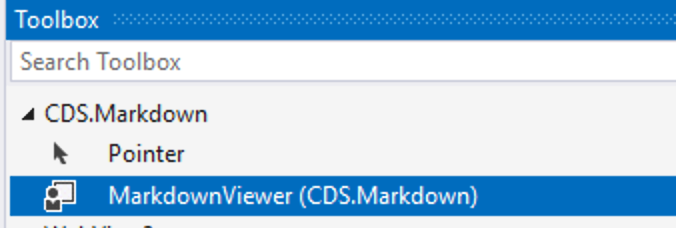
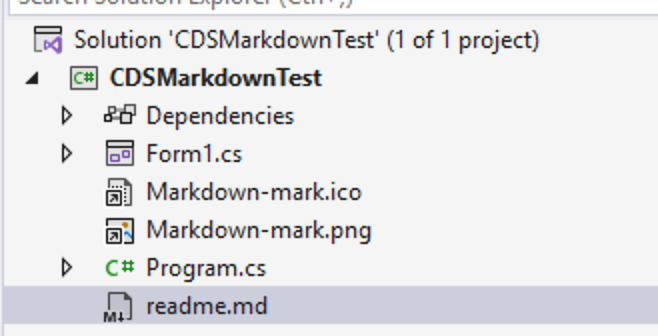
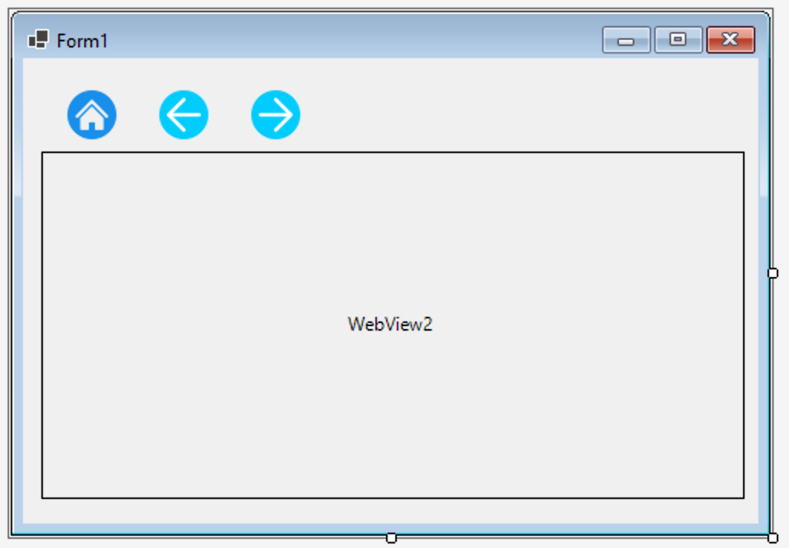

# CDS.MarkDown Solution


This repository contains:

- **CDS.Markdown**: A .NET WinForms control for rendering Markdown using Markdig and WebView2. Designed for easy integration into your own WinForms applications.
- **Demo**: A sample WinForms application demonstrating how to use the CDS.Markdown control to display Markdown files.

**Compatible with:**
- .NET 8
- .NET 10

## Projects Overview

### CDS.Markdown
- **Type**: .NET WinForms Class Library (net8.0-windows, net10.0-windows)
- **Purpose**: Provides a reusable `MarkdownViewer` control for rendering Markdown content in WinForms apps.
- **Key Features:**
  - Renders Markdown using [Markdig](https://github.com/lunet-io/markdig)
  - Displays HTML via [WebView2](https://learn.microsoft.com/en-us/microsoft-edge/webview2/)
  - Supports advanced Markdown extensions
  - Uses embedded [GitHub Markdown CSS](https://github.com/sindresorhus/github-markdown-css) for GitHub-style rendering
  - Easy to use: just add the control and call `LoadMarkdown()`
- **NuGet**: Ready for packaging and public release

### Demo
- **Type**: .NET WinForms Application (net8.0-windows, net10.0-windows)
- **Purpose**: Shows how to use the `MarkdownViewer` control in a real application.
- **Usage**: Loads and displays Markdown files from the project directory.


> Click here to view the demo wiki pages: [CDS.Markdown Demo Wiki](Demo/wiki/index.md)

## How to Use CDS.Markdown

1. Use the Nuget package manager to install the `CDS.Markdown` package 
   in your WinForms project.
2. Add a `MarkdownViewer` control to your form.

{width=300px}

3. Create a Markdown file in your project directory, for example `readme.md`.

{width=300px}

4. Set the Markdown file's Copy to Output Directory to `Copy if newer`.

{width=300px}

{width=400px}

5. In your form's code, call the `LoadMarkdown()` method on the 
   `MarkdownViewer` control, passing the path to your Markdown file:
   ```csharp
    protected async override void OnShown(EventArgs e)
    {
        base.OnShown(e);
        await markdownViewer1.LoadMarkdownAsync("readme.md");
    }
   ```

> Tip 1: the viewer expects the any Markdown files to be in the same directory 
as the executable, or a subdirectory of it. See the `Demo` project for an example
of using subdirectories.

> Tip 2: the project uses the WebView2 control which causes compile time
warnings around version conflicts with the WindowsBase assembly. The
following property can be added to the project file to suppress these warnings:
```xml
<PropertyGroup>
    <NoWarn>$(NoWarn);MSB3277</NoWarn>
</PropertyGroup>
```


## GitHub Markdown CSS

This project embeds [github-markdown-css](https://github.com/sindresorhus/github-markdown-css) as an embedded resource to provide GitHub-style Markdown rendering.  
The CSS is included in the assembly, so no additional files or downloads are required when consuming the package.

## How this was written!
I couldn't find an existing WinForms Markdown control that met my needs, 
so I reviewed the requirements with ChatGPT and used it to create a detailed 
prompt for Copilot Agent mode. This helps created the initial code, including
HTML, scripts and CSS. Nearly every other change was also done via prompts,
a process I'm calling `flow coding` :smile: It's like Vibe Coding, but 
with a more human interaction and many files and projects!

## Attributions

The [github-markdown-css](https://github.com/sindresorhus/github-markdown-css) is licensed under the MIT License:
