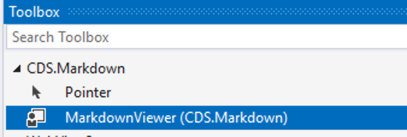
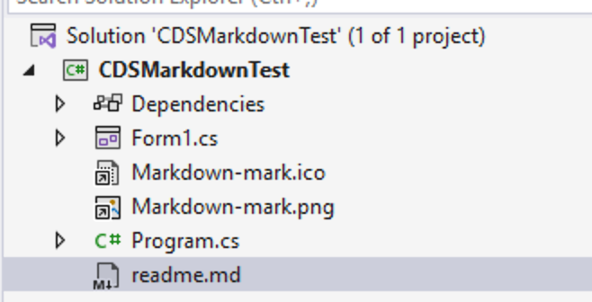
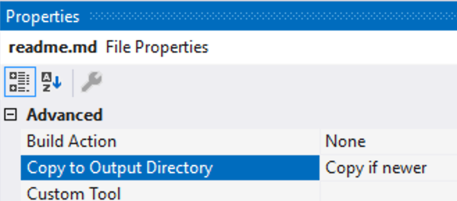
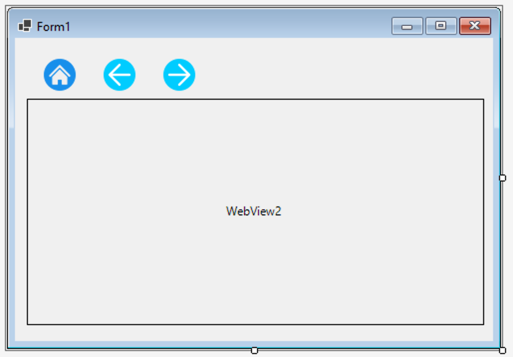

# Markdown Viewer Guide

The `MarkdownViewer` is a WinForms UserControl that renders Markdown using Markdig and WebView2.

## Setup Instructions

1. Use the NuGet package manager to install the `CDS.Markdown` package in your WinForms project.
2. Add a `MarkdownViewer` control to your form.

{width=300px}

3. Create a Markdown file in your project directory, for example `readme.md`.

{width=300px}

4. Set the Markdown file's **Copy to Output Directory** to `Copy if newer`.

{width=300px}

{width=400px}

5. In your form's code, call the `LoadMarkdownAsync()` method on the `MarkdownViewer` control, passing the path to your Markdown file:

```csharp
protected async override void OnShown(EventArgs e)
{
    base.OnShown(e);
    await markdownViewer1.LoadMarkdownAsync("readme.md");
}
```

## Tips

> **Tip 1:** The viewer expects any linked Markdown files to be in the same directory as the executable, or a subdirectory of it. See the `Demo` project for an example of using subdirectories.

> **Tip 2:** The project uses the WebView2 control which causes compile-time warnings around version conflicts with the `WindowsBase` assembly. The following property can be added to your `.csproj` file to suppress these warnings:
```xml
<PropertyGroup>
    <NoWarn>$(NoWarn);MSB3277</NoWarn>
</PropertyGroup>
```

## Advanced Rendering

The viewer automatically supports:
- **GitHub Flavored Markdown**: Styled using embedded `github-markdown-css`. 
Support for Dark, Light, and System themes by setting 
`markdownViewer.Options.Theme` to `MarkdownViewerTheme.Dark`, 
`MarkdownViewerTheme.Light`, or `MarkdownViewerTheme.System`.
- **Mermaid Diagrams**: Rendered offline using an embedded `mermaid.min.js`.
- **Mathematics**: LaTeX-style math blocks (`$$`) rendered offline using an embedded MathJax SVG engine.

## Embedding as a Fragment

By default the viewer is built for a standalone document pane, complete with a Home/Back/Forward
toolbar. When you're embedding it as a small piece of a larger UI instead — a chat message bubble,
a preview pane, a details panel — consider `MarkdownTextBox` first (see below); if you need it to
stay `MarkdownViewer`, two things help it behave like a fragment rather than a document viewer:

- **`Options.ShowNavigationToolbar`** (`bool`, default `true`) — set to `false` to hide the
  toolbar and let the rendered content fill the whole control. There's no "home" document or
  anywhere to navigate to/from in a fragment, so the toolbar is usually dead weight there.
- **`ContentHeightChanged`** (`event EventHandler<int>`) and **`GetContentHeightAsync()`** — a host
  that wants to size its own container to the content (rather than fixing a height up front) can
  subscribe to this event to learn the rendered height in CSS pixels, both after the initial render
  and again if it changes afterwards (web fonts finishing, Mermaid/MathJax reflowing content, etc.).
  `GetContentHeightAsync()` is there for a one-off, on-demand reading instead.

```csharp
markdownViewer1.Options.ShowNavigationToolbar = false;
markdownViewer1.ContentHeightChanged += (_, height) =>
{
    markdownViewer1.Height = height;
};
```

### Cost of many instances

Nothing stops you from creating many `MarkdownViewer` instances in the same process — each one
manages its own `WebView2` control, but by default they all share the same WebView2
profile/environment (`Options.UserDataFolder`/`ProfileName` default to the same shared
`%LocalAppData%` path and `"Default"` profile name unless you override them per instance), so you
get browser-process sharing for free without doing anything.

What sharing *doesn't* remove is WebView2's per-instance renderer process — that's inherent to its
site-isolation model, not something `MarkdownViewerOptions` can configure away. The numbers below
are one measurement on one dev machine (Windows 11, .NET 10, WebView2 SDK `1.0.4129.50`, Evergreen
runtime `151.0.4129.93`) —
treat them as an order-of-magnitude ballpark, not a guarantee, but they're real measurements rather
than a guess: 20 sequential create → render → dispose cycles, and 15 concurrently-alive instances,
each loading a short paragraph-plus-table Markdown snippet (a typical chat-reply-sized turn),
against the class as it exists today.

| Scenario | First render | Steady-state render | Host process memory | WebView2 child processes |
|---|---|---|---|---|
| Cold start (1st instance ever) | ~600-800 ms | — | — | — |
| Sequential churn (create → render → dispose, one at a time) | — | ~270-400 ms per cycle | grew to ~190 MB private bytes over 20 cycles and didn't shrink back down after disposal + GC | 0 once each instance is disposed — WebView2 tears its renderer down promptly |
| 15 instances alive concurrently | — | — | ~270 MB private bytes in the host process | ~20 processes, ~1.7 GB total working set (mostly one renderer process per live instance) |

Two practical conclusions follow from that:

- **"One instance per chat message, created and disposed as the transcript scrolls" is a supported
  scenario.** Each cycle costs a few hundred milliseconds and disposal promptly tears down that
  instance's renderer process — nothing here rules it out, and it's the shape
  `CDS.ScriptChat.WinForms` originally asked about (see `todo.md`).
- **Keeping dozens of instances alive and rendered at once is the expensive case**, at roughly
  100+ MB of WebView2 process memory per concurrently-visible instance, on top of a few hundred KB
  of managed overhead each in the host process. A `FlowLayoutPanel` full of message bubbles that
  keeps every past turn's `MarkdownViewer` alive and rendered will accumulate this cost linearly
  with scrollback length. If you need many bubbles to coexist in a long-lived session, prefer:
  - **UI virtualization** — only construct/load a `MarkdownViewer` for bubbles that are actually
    scrolled into view (or near it), disposing ones that scroll far enough out, rather than keeping
    every turn's control alive for the life of the session; or
  - **A pool of reused viewers** — a small fixed number of `MarkdownViewer` instances that get
    re-targeted (`LoadMarkdownFromStringAsync` again) as bubbles scroll in and out, rather than one
    instance per turn ever created.

  Or side-step the cost entirely: if the content is prose-sized (a chat reply, not a rendered
  README), **`MarkdownTextBox`** (below) needs none of this — no WebView2 process per instance
  means no per-instance renderer cost to manage in the first place.

  The `UiTests` project (FlaUI-based, see its README-equivalent comments in
  `UiTests/DemoAppLauncher.cs`) is a reasonable place to add a regression test here if this
  guidance ever needs re-validating — it can drive real concurrent/churning instances against the
  `Demo` app and read back real WinForms/WebView2 process state, the same way the numbers above
  were produced.

## MarkdownTextBox: a Lighter Alternative

`MarkdownTextBox` is a `RichTextBox` subclass driven by Markdig — no WebView2, no browser process,
no navigation chrome. Call `SetMarkdown(string?)` to render, and `GetPreferredContentHeight()` for
a synchronous height reading (no async round-trip to a browser process is needed, unlike
`MarkdownViewer.ContentHeightChanged`/`GetContentHeightAsync()`).

```csharp
markdownTextBox1.SetMarkdown("**Hello**, world!");
var height = markdownTextBox1.GetPreferredContentHeight();
```

It handles a deliberately smaller subset of Markdown than `MarkdownViewer`: headings, bold/italic,
inline and fenced code, lists (including nesting), block quotes, thematic breaks, and tables
rendered as a padded monospaced grid. It does **not** attempt Mermaid diagrams, MathJax, real HTML
tables, images beyond an italic placeholder, or clickable links — it's a prose-formatting control,
not a document viewer. See the `Demo` project's "MarkdownTextBox" menu entry (or
`Demo/Program.cs`'s `--textbox` switch) for it running against real content.

| | `MarkdownViewer` | `MarkdownTextBox` |
|---|---|---|
| Rendering | Real browser (WebView2) | `RichTextBox` |
| Per-instance cost | A WebView2 renderer process each (see above) | Whatever any other `RichTextBox` costs |
| Mermaid / MathJax / real tables / images / links | ✅ | ❌ |
| Height signal | `ContentHeightChanged` event / `GetContentHeightAsync()` (async) | `GetPreferredContentHeight()` (synchronous) |
| Best for | A full document, or content that needs the above | Many small fragments — chat bubbles, prose-sized previews |
